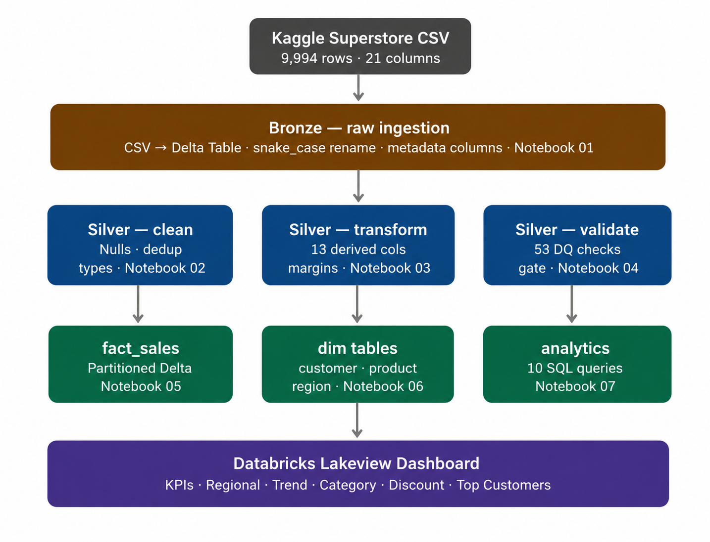
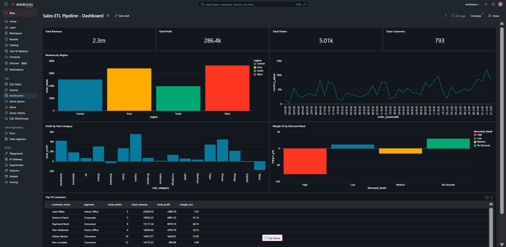
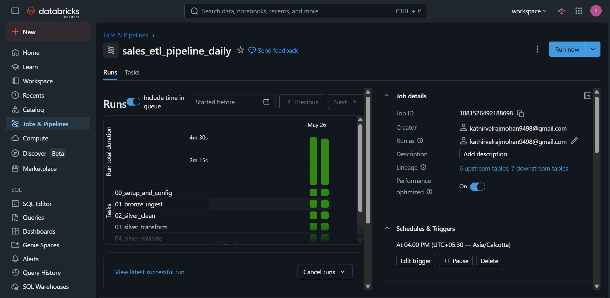

# Sales ETL Pipeline — Databricks | PySpark | Delta Lake

An end-to-end Data Engineering project built on Databricks Free Edition
using the Medallion Architecture pattern. Ingests raw sales data,
transforms it through Bronze → Silver → Gold layers, and serves
business insights through a live dashboard.

---

## Architecture

---

---

## Dashboard Preview and Job Overview

> Built on Gold Delta tables 
> via scheduled Databricks Jobs.

---

## Tech Stack

| Layer | Technology |
|---|---|
| Compute | Databricks Serverless |
| Processing | PySpark DataFrame API |
| Storage | Delta Lake (ACID, time travel) |
| SQL | Spark SQL |
| Orchestration | Databricks Jobs (scheduled DAG) |
| Dashboard | Databricks Lakeview Dashboards |
| Dataset | Kaggle Superstore Sales (9,994 rows) |

---

## Project Structure

| Notebook | Purpose |
|---|---|
| 00_setup_and_config | Centralised config, paths, logging utility |
| 01_bronze_ingest | Raw CSV → Delta Table, metadata columns |
| 02_silver_clean | Null handling, deduplication, type casting |
| 03_silver_transform | 13 derived columns (profit_margin, shipping_days, etc.) |
| 04_silver_validate | 53 automated data quality checks, pipeline gate |
| 05_gold_fact_sales | fact_sales — partitioned Delta table |
| 06_gold_dim_tables | dim_customer, dim_product, dim_region |
| 07_analytics_queries | 10 business SQL queries |

---

## Key Concepts Demonstrated

- Medallion Architecture (Bronze / Silver / Gold)
- Delta Lake — ACID transactions, time travel, schema evolution
- PySpark DataFrame API — transformations, window functions, joins
- Star Schema dimensional modelling (Kimball methodology)
- Data quality framework — 53 automated checks with CRITICAL/WARNING severity
- Idempotent pipeline design — safe to re-run at any step
- Partition pruning — fact_sales partitioned by order_year + order_month
- Slowly Changing Dimensions — Type 1 resolution with majority vote
- Databricks Jobs — scheduled DAG with email alerting

---

## Business Insights Uncovered

- West region leads revenue; East leads profit margin
- High discount band (>40%) produces negative profit margins
  — transactions with high discounts are loss-making 100% of the time
- Tables and Bookcases sub-categories are consistently loss-making
- Top revenue customer (Sean Miller, $25K) generates negative profit
  due to systematic heavy discounting
- Business shows clear year-over-year growth in the monthly trend

---

## Pipeline Schedule

Runs daily at 6:00 AM via Databricks Jobs.
Email alerts on failure — pipeline halts automatically
if any CRITICAL data quality check fails.

---

## Dataset

Kaggle Superstore Sales Dataset
- 9,994 rows, 21 columns
- Orders across US regions, 2014–2017
- Categories: Furniture, Office Supplies, Technology
